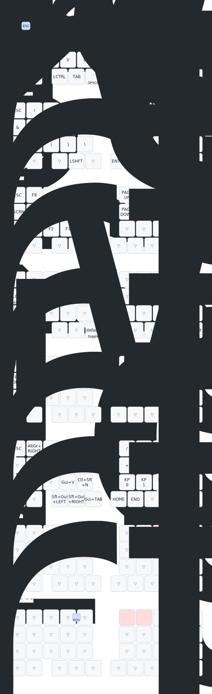

# KobitoKey_QWERTY

小人キーや人キーのケース、TypeSurfer各種の3DデータはReleasesよりダウンロード出来ます。
ダサい使い方はしないこと。

ZMKファームウェア + トラックボール×2（左右分割）搭載のカスタムキーボード用コンフィグです。

## キーマップ

`config/KobitoKey.keymap` を変更すると、GitHub Actionsが自動でキーマップ図を再生成します（[keymap-drawer](https://github.com/caksoylar/keymap-drawer)使用）。

## 機能一覧

### トラックボール

- **左トラックボール**: 縦スクロール専用（速度に応じた加速つき）
  - Y+U同時押し中は左右movementが水平スクロールに切替（ブラウザのタブ切替用、PC側の常駐ツールと組み合わせて使用）
- **右トラックボール**: 通常はカーソル操作。動かすと自動でオートマウスレイヤー(layer3)に入る
  - オートマウスレイヤー中: 左手ホームロウ(A/S/D/F)でGUI/Shift/Ctrl/Altのワンショット修飾（片手クリック用）
  - 7+8同時押し（オートマウス中も可）でスクロールレイヤー(layer6)に切替、縦スクロール専用（速度に応じた加速つき）
- カーソル速度・スクロール速度・加速の強さは左右独立で調整可能

### キーマップ

- **Positional Hold-Tap（HRM）**: ホームロウのMod-Tap/Layer-Tapは、反対の手のキーが押されたときだけホールド判定。同じ手のロール入力での誤Shift・誤レイヤーを防止
- **Sticky Shift（ダブルタップ）**: 2箇所のShiftキーで、素早く2回タップすると次の1キーだけ大文字化するSticky Shiftが発動（通常のタップ/ホールド動作はそのまま維持）
- Combo（同時押し）: Escキー、スクロールレイヤー起動、Bluetoothレイヤー起動、タブ切替レイヤー起動

### レイヤー構成

| # | ラベル | 起動方法 | 内容 |
|---|---|---|---|
| 0 | (default) | 常時 | QWERTY配列 + HRM |
| 1 | character | Spaceホールド | 記号・数字 |
| 2 | arrow | F または Enterホールド | 矢印キー・ページ送り |
| 3 | MOUSE | 右トラボ操作で自動 | マウスクリック・片手修飾キー |
| 4 | shortcut | R+Tコンボ(`&sl 4`) | Bluetooth切替・ファンクションキー |
| 5 | (Mac/Numpad) | Dホールド | テンキー・Mac向けウィンドウ操作ショートカット |
| 6 | scroll | 7+8コンボ | 右トラボを縦スクロールに切替 |
| 7 | tabswitch | Y+Uコンボ | 左トラボを水平スクロールに切替（タブ切替用） |

### その他

- [Prospector](https://github.com/t-ogura/zmk-config-prospector)対応: BLE接続スロットを使わずにバッテリー・レイヤー等のステータスを外部表示器へブロードキャスト

## 既知の問題

- スクロールレイヤー用コンボ(7+8)とlayer3のマウスクリック位置(7,8)が重なっており、オートマウス中にドラッグ操作が不安定になることがある（対応検討中）
